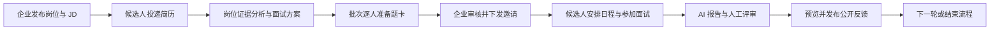
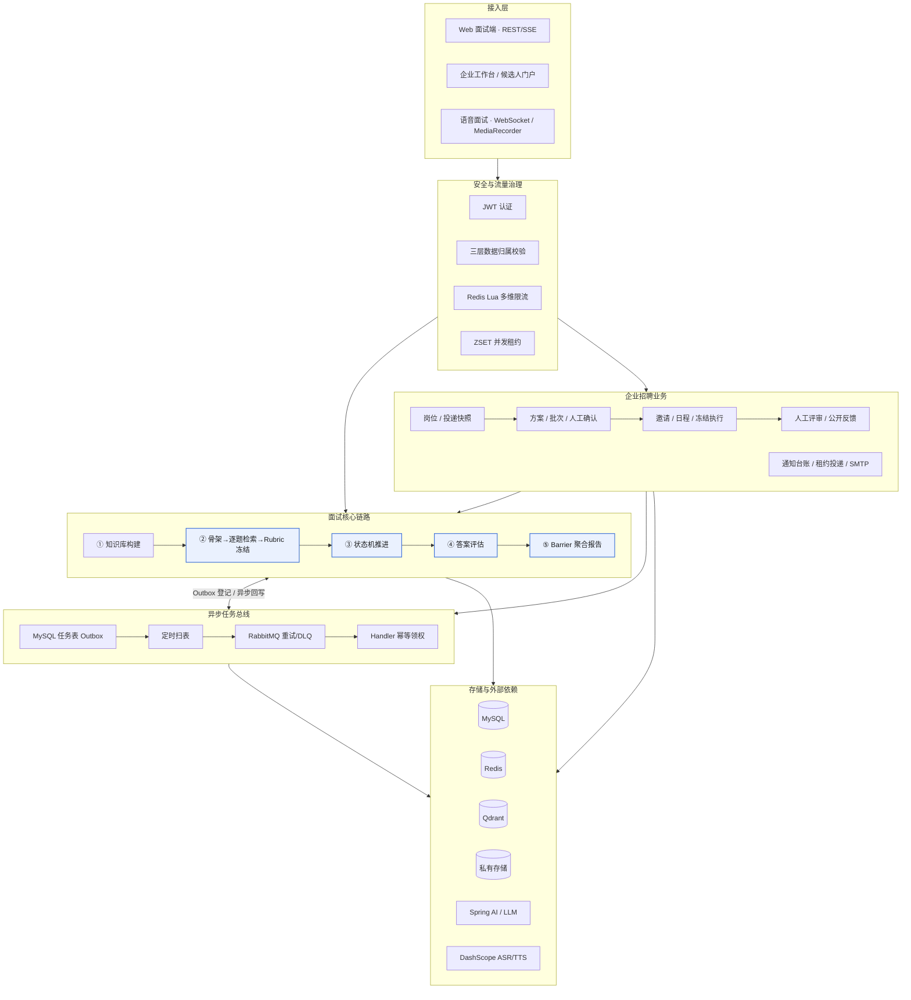
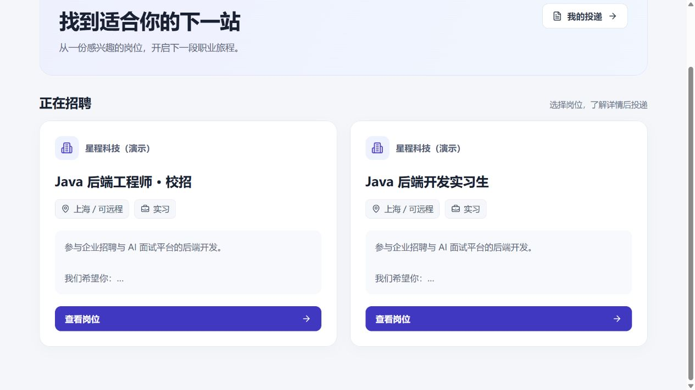
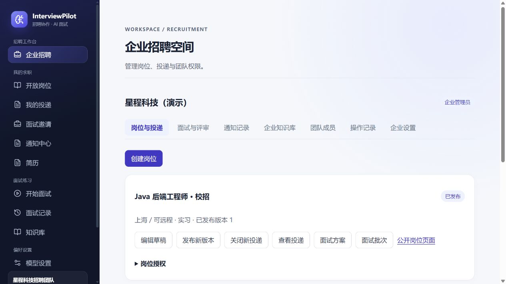
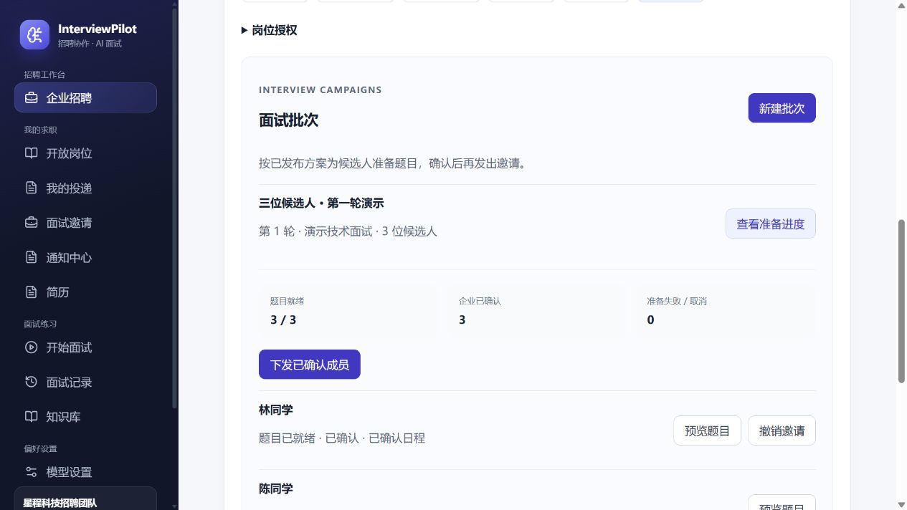
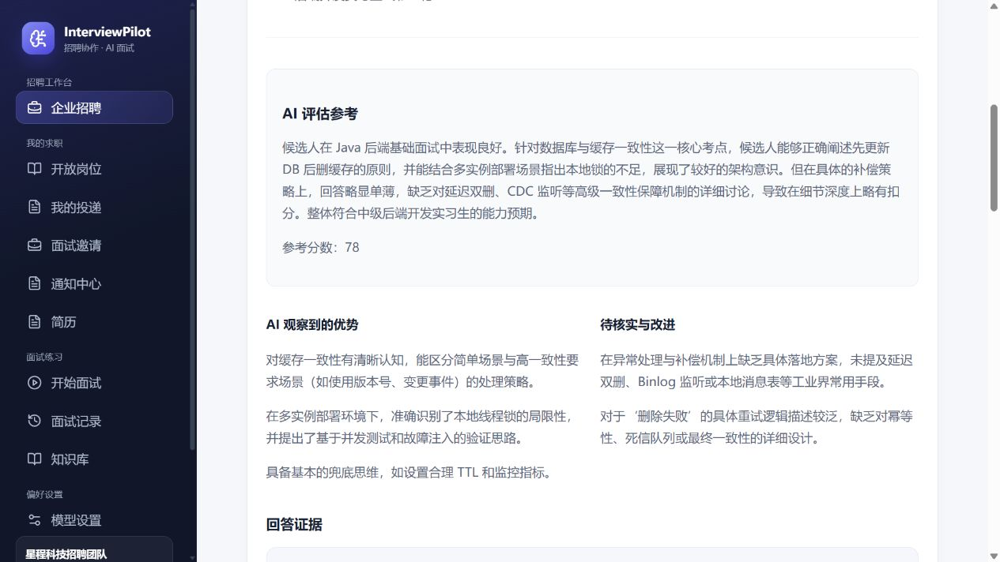
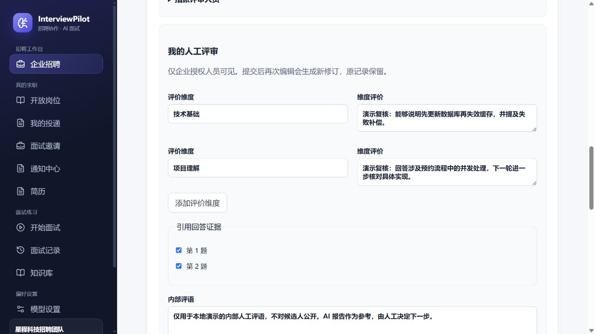
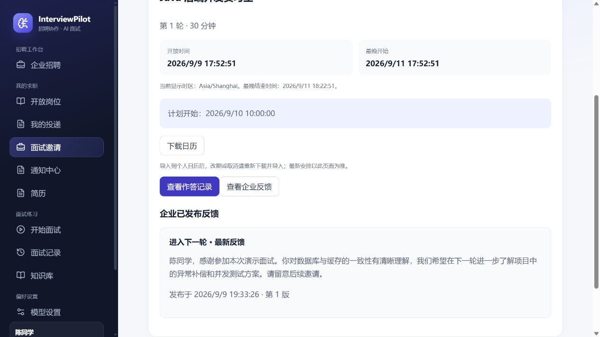
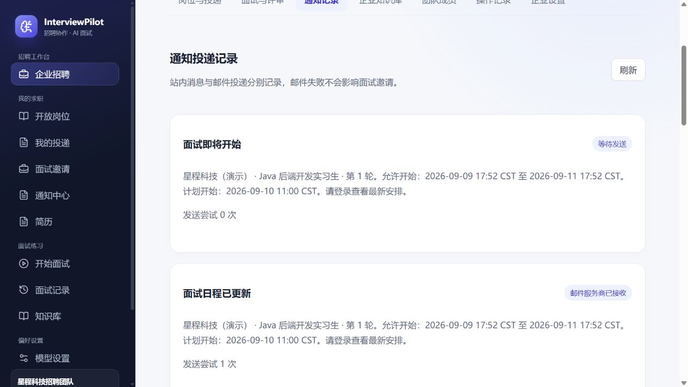

# InterviewPilot

InterviewPilot 是一个基于 Spring Boot 与 React 的企业面试管理与 AI 辅助评估系统，同时保留个人模拟面试能力。企业可以发布岗位、接收简历投递，结合 JD、简历与企业知识库准备面试题，人工确认后批量下发邀请；候选人安排日程并完成面试，企业结合回答证据和 AI 报告进行人工评审，再独立发布公开反馈。

项目采用单体分模块架构，围绕权限隔离、材料快照、异步任务、并发作答和可靠通知实现业务闭环。AI 负责分析、出题与辅助评估；题目下发和反馈发布由企业人员确认。

## 业务流程与入口



| 使用者 | 页面入口 | 主要功能 |
|---|---|---|
| 企业管理员 / 招聘人员 | `/enterprise` | 岗位、投递、面试方案、批次、评审、通知记录及团队权限 |
| 被指派的面试官 | `/enterprise` → 面试与评审 | 查看授权面试的回答证据、保存草稿和提交评审 |
| 求职者 | `/jobs`、`/candidate/applications` | 浏览开放岗位、投递简历、查看投递状态 |
| 求职者 | `/candidate/invitations` | 安排面试、下载 ICS 日程、开始或恢复作答、查看公开反馈 |
| 登录用户 | `/notifications` | 站内通知与已读状态 |
| 个人练习用户 | `/resumes`、`/interviews/new` | 简历分析、模拟面试及个人报告 |

企业招聘与个人练习使用不同的执行规则和报告可见范围。企业面试按确认后的冻结题卡执行，不追加动态追问；候选人不能直接查看企业内部 AI 报告，只能查看企业明确发布的反馈。

## 整体架构

系统自上而下分为接入层、安全与流量治理、面试核心链路、异步任务总线和存储/外部依赖五层；耗时的大模型调用与业务状态推进解耦，一致性与可靠性作为横切设计贯穿各层。



## 项目展示

以下企业招聘截图来自本地实际运行页面，使用「星程科技（演示）」和合成候选人数据。截图日期：2026-09-09。操作步骤见[评审与通知指南](docs/hiring-review-notification-guide.md)。

### 开放岗位

岗位以卡片呈现，集中展示公司、岗位名称、地点与工作类型；通过明确的「查看岗位」按钮进入详情和投递流程。



### 企业招聘工作台

在企业空间内管理岗位及发布版本，并进入投递、面试方案、批次和岗位授权；评审、通知与团队管理集中在同一工作区。



### 面试批次与逐人准备

按已发布方案为候选人准备题目，查看准备与确认数量，逐人预览题卡。企业确认后下发邀请，并查看候选人的日程状态。



### AI 辅助评估

企业查看面试总结、参考分数、优势与待核实问题，并结合逐题回答证据开展评审。AI 结果作为人工判断的参考。



### 人工评审

评审人员按维度填写评价、引用回答证据并记录内部评语。草稿可继续编辑，正式提交保留历史修订；候选人反馈在独立区域预览和发布。



### 候选人日程与公开反馈

候选人在面试邀请中查看安排、下载日历和回看作答记录。企业发布反馈后，这里展示公开内容、下一步决定和发布版本。



### 通知与邮件记录

企业查看日程更新及面试提醒的投递状态与尝试次数。本地截图中的「邮件服务商已接收」来自测试 SMTP 接收器，不代表外部邮箱已送达。



<details>
<summary>展开个人练习与通用能力截图</summary>

以下为此前版本的个人练习界面截图。

#### 简历分析

对简历进行结构化分析，展示评分与内容、技能、项目经历方面的改进建议。


#### 创建个人模拟面试

选择简历、面试方向、岗位要求、难度、模型和知识库，创建结构化练习。


#### 知识库

上传文档、查看索引状态和分段数量，并支持重建索引。


#### 实时语音

流式转写实时回显，用户手动确认后提交回答；支持语音播报和录音转写兜底。


#### 个人面试报告

练习结束后查看综合评分、能力维度、优势与改进方向。企业内部报告采用独立的可见范围。


</details>

## 功能特性

### 企业招聘

- 企业、成员角色与岗位授权；企业知识库和业务数据按归属隔离。
- 岗位发布版本、简历投递快照、撤回与显式重新投递；历史材料不随后续修改改变。
- 基于 JD 和简历的异步岗位证据分析，面试方案发布后保留不可变版本。
- 面试批次逐人准备公共题与定制题，保留评分依据和知识引用，支持人工调整、逐人确认及部分下发。
- 邀请确认、拒绝、取消、窗口内安排和改期，支持 ICS 日程下载；变更后需重新导入日历。
- 邀请绑定唯一面试会话，按冻结题卡作答，支持断线恢复、截止时间与超时收尾。
- 人工评审指派、不完整草稿、不可变提交修订及历史查询；公开反馈独立预览和版本化发布。
- 站内通知、SMTP 邮件及默认提前 24 小时 / 1 小时提醒；支持过时提醒跳过、发送记录和有限重试。

### 个人练习与通用能力

- 支持 TXT、PDF、DOCX 简历上传、文本提取和结构化分析。
- 内置 Java 后端、Python 后端、前端、AI Agent、测试开发、算法、系统设计和自定义岗位 8 个面试 Skill。
- 固定面试方向可以直接使用，也可以通过可选 JD 补充要求；自定义岗位必须提供岗位名称和 JD。
- 创建面试时固化 Skill、模型、岗位要求和面试计划快照，避免后续配置变化影响历史面试。
- 提交答案通过 POST SSE 渐进返回 `ACCEPTED`、`PROCESSING`、`RESULT`（下一题/结束）状态，异常时返回 `ERROR`。
- 出题阶段由结构化模型一次性生成题卡；运行期由纯 Java 的固定流程策略按阶段、主问题数量与每卡追问配额决策，追问不占用主问题预算，模型不直接改写业务状态。
- 支持知识库上传、异步索引、Qdrant 向量召回和面试 RAG 上下文注入。
- 面试结束后通过 RabbitMQ 可靠异步生成报告，支持重试、死信和人工恢复。
- 语音面试支持实时对话（单条 WebSocket、流式 ASR、服务端 VAD 自动断句、实时字幕、候选人手动确认提交、实时 TTS）与 MediaRecorder 录音转写两种模式，实时作答复用同一套回合引擎与幂等控制。
- 提供面试历史、报告查询、模型切换、健康检查、指标和 Trace ID。

知识库/RAG 需要显式开启 `KNOWLEDGE_ENABLED=true` 并配置 Embedding API Key；混合检索使用 `KNOWLEDGE_RETRIEVAL=hybrid`。语音面试通过 `VOICE_ENABLED=true` 开启，实时对话与录音转写均要求候选人确认答案。

当前企业招聘主流程已接通，完整 V1 仍有独立题库、超出窗口的改期审批、配额及运维压测等待办；计费和通用报告导出未实现。范围与进度见[实施方案](docs/enterprise-interview-v1-plan.md)和[实施进度](docs/enterprise-interview-v1-progress.md)。

## 技术栈

- 后端：Java 21、Spring Boot 4、Spring MVC、WebSocket、Spring Data JPA、Hibernate、Flyway、Spring AI
- 数据库：MySQL 8.4
- 消息队列：RabbitMQ 4
- 邮件：Spring Boot Mail、SMTP，MySQL 通知台账与发送租约
- 向量库：Qdrant
- 语音：DashScope 实时 ASR/TTS（Qwen3-Realtime，WebSocket），MediaRecorder 非实时转写兜底
- 缓存与并发协调：Redis 7.4、Redisson
- 前端：React 18、TypeScript、Vite、Vitest
- 网关：Nginx
- 测试：JUnit 5、Testcontainers、WireMock、Testing Library
- 部署：Docker、Docker Compose

## 架构与后端设计

### MySQL 作为业务事实来源

MySQL 持久化简历、分析结果、岗位要求、Skill 快照、面试计划、会话、轮次、回答尝试、报告和异步任务状态，同时保存企业、投递、批次邀请、评审修订、公开反馈和通知台账。Redis 标记和 RabbitMQ 消息只承担协调职责，消费者处理任务前始终重新检查 MySQL 状态。

Skill、Provider、Model 和 InterviewPlan 都会在创建面试时生成不可变快照。即使之后修改默认模型或 Skill 文件，已经开始的面试仍使用创建时的版本。

### 个人练习流程与受控的 AI 输出

题卡在出题阶段由结构化模型一次性生成；运行期的题目推进不交给模型，而由纯 Java 的 `FixedInterviewFlowPolicy` 决策，模型不直接改写业务状态。其规则如下：

- 阶段固定为 `SELF_INTRODUCTION → FUNDAMENTALS → PROJECT_EXPERIENCE → SCENARIO_TRADEOFF → END`。
- 面试规模分 Quick/Standard/Deep 三档，分别规划 6/9/12 个主问题（各阶段数量固定），追问另计、不占用主问题预算。

每张题卡有独立追问配额：未用完则继续 `FOLLOW_UP`，用完进入同阶段下一主问题，阶段主问题问完即切换阶段，全部阶段结束即 `END`；自我介绍阶段不产生追问。

所有结构化模型输出（题卡、追问、报告）都必须反序列化为受约束的 Java Record；字段缺失、枚举非法或结构错误都会被识别为无效输出，而不是直接进入数据库；追问生成失败时回退到题卡内置的兜底追问，不阻断面试流程。

### 并发与幂等

每次回答都要求客户端提供 UUID `requestId`。后端通过唯一键、答案指纹、回答尝试记录和 JPA `@Version` 实现并发保护：

- 相同 `requestId` 和相同答案可以重放已有结果。
- 相同 `requestId` 携带不同答案会被拒绝。
- 只有持有当前版本的处理者能够完成轮次、创建下一题或触发报告任务。
- SSE 连接断开不会自动重复提交；前端先通过 GET 恢复持久化状态，再由用户显式发起新的重试。

企业面试的新作答请求还必须携带 `expectedTurnNo` 和 `sessionVersion`，并纳入幂等指纹，防止旧标签页把回答写入新题。实时语音绑定实际下发的题目版本，在处理队列中再次校验识别代次，丢弃重复确认及迟到转写。

企业写操作按统一顺序加锁，评审草稿和反馈发布分别校验版本；同一版本并发发布只允许一个请求成功，旧轮次不能覆盖已进入后续轮次的流程结果。

### 人工评审与可靠通知

企业内部回答、AI 评估、冻结评分依据及知识证据仅向授权人员开放。面试官需要逐场指派；管理员或授权招聘人员才能选择已提交的评审修订，另行填写并发布候选人反馈。评审历史与公开反馈分别存储，候选人接口不返回内部评语和评分依据。

通知与业务变更在同一事务写入 MySQL。邮件在独立后台线程中发送，以唯一事件键去重，并通过领取令牌和租约协调多实例。旧日程或已结束邀请的提醒会被跳过；明确连接失败有限重试，超时或发送中断标记为 `UNKNOWN`，不自动重发。SMTP 接受不等于邮件已被阅读，站内已读独立记录。

### 事务与模型调用边界

耗时的大模型调用不会占用数据库事务：

1. 短事务校验状态并领取处理权。
2. 在事务外调用模型并校验结构化结果。
3. 新短事务重新检查版本和所有权，再持久化结果并推进状态。

这种方式减少了数据库锁占用，同时允许通过版本围栏丢弃已经失去所有权的迟到结果。

### RabbitMQ 可靠异步任务

简历分析、知识库索引和面试报告通过数据库任务表与 RabbitMQ 协作处理。任务发布使用 Publisher Confirm，并配置分级延迟重试队列和 DLQ。由于数据库提交和消息发布无法形成一个本地原子事务，系统采用任务表扫描、周期重发和消费者幂等实现至少一次投递。

### 知识库与 RAG

知识库文档上传后会先进入 `PROCESSING`，后台任务负责解析文件、切分文本，先将分块写入 MySQL 的 `knowledge_chunk` 表，再向量化写入 Qdrant，并在成功后标记为 `READY`。两路使用相同的确定性分块 ID，失败重试可以幂等重放。文档列表会返回 `PENDING`、`PROCESSING`、`READY`、`FAILED`、`DELETING` 等可见状态，前端会对索引中的文档轮询刷新。

检索默认使用 `KNOWLEDGE_RETRIEVAL=vector`，保持原有单路向量检索行为。设为 `hybrid` 后，增加 MySQL 原生 ngram FULLTEXT 词法召回：优先使用题目检索关键词，没有有效关键词时使用查询文本；两路结果按分块 ID 通过 RRF（`k=60`）融合，再统一做近似去重、Top-K 和字符预算裁剪。不引入 ES、重排模型或新中间件。

混合检索只比较各路候选排名，不直接比较 FULLTEXT 与向量原始分数。返回的融合分数按理论最大值归一到 `[0,1]`，仅用于排序；向量相似度阈值仍只约束向量候选，不过滤词法候选或融合结果。任一路失败时仍可使用另一路的命中；没有命中且存在失败时返回 `UNAVAILABLE`。

升级后，已有文档不会自动生成 MySQL 分块镜像。需要词法召回的历史文档应在知识库页面执行「重建索引」，完成后创建新面试使用新版本；已有面试继续使用冻结的文档版本，未有镜像的旧版本仍可走向量召回。切回 `vector` 只需修改配置并重启应用，分块双写会继续保留。

创建面试时如果选择知识库，系统只会把当前 `READY` 文档纳入召回范围；每轮生成题目或评估答案前都会按用户、知识库、文档和索引版本过滤召回结果，避免跨用户、跨知识库或旧版本内容进入上下文。删除文档会清理文件和向量，并把旧索引消息视为终态，避免晚到消息反复重试。

### Redis 的职责

Redis 只承担三类短期协调职责：

- API 固定窗口限流。
- 全局大模型并发租约。
- 异步 Worker 和回答处理的短期 Claim。

Redis 不保存面试业务事实。即使锁或标记因异常丢失，MySQL 中的任务状态、尝试次数和版本字段仍是最终判断依据。

## 快速开始

### 环境要求

推荐使用 Docker Compose 一键启动，需要：

- Docker Desktop 或其他支持 Compose v2 的 Docker 环境
- 至少一个可用的大模型 Provider API Key

本地开发还需要：

- JDK 21
- Node.js 22
- Corepack
- 可连接的 MySQL、Redis 和 RabbitMQ

项目已经包含 Gradle Wrapper，不需要全局安装 Gradle。

### 使用 Docker Compose 启动

先按下方[配置说明](#配置说明)创建 `.env`，设置数据库凭据、JWT 密钥和至少一个模型 Provider，再启动：

```bash
docker compose up -d --build
```

启动完成后：

- 前端页面：`http://localhost:3000`
- 健康检查：`http://localhost:3000/actuator/health`
- RabbitMQ 管理页面：`http://localhost:15672`
- MySQL：`localhost:3306`
- Redis：`localhost:6379`

Nginx 是 Compose 中唯一公开的应用入口，同时代理前端、`/api` 和 Actuator。Spring Boot 的 8080 端口只在 Docker 内部网络开放，避免外部客户端伪造限流所依赖的转发地址。Nginx 会覆盖 `X-Forwarded-For`，Spring 再通过 Framework Forward Headers 解析可信来源地址。

查看容器状态和日志：

```bash
docker compose ps
docker compose logs -f app frontend mysql redis rabbitmq
```

停止服务：

```bash
docker compose down
```

只有明确需要删除 MySQL、Redis 和 RabbitMQ 数据卷时才使用：

```bash
docker compose down -v
```

可以在 `.env` 中修改公开端口，避免与本机已有服务冲突。

### 本地开发

只通过 Docker 启动基础设施：

```bash
docker compose up -d mysql redis rabbitmq
```

启动后端：

```bash
./gradlew bootRun
```

Windows PowerShell：

```powershell
.\gradlew.bat bootRun
```

启动前端：

```bash
cd frontend
corepack enable
pnpm install --frozen-lockfile
pnpm dev
```

前端默认访问 `http://localhost:5173`，Vite 会将 `/api` 代理到 `localhost:8080`。Spring Boot 会读取项目根目录中可选的 `.env` 文件。本地启用知识库时，还需启动并向宿主机映射 Qdrant 的 gRPC 端口（默认 `6334`）；Compose 中的 Qdrant 默认仅在容器网络内开放。

## 配置说明

复制环境变量示例：

```bash
cp .env.example .env
```

Windows PowerShell 可以使用：

```powershell
Copy-Item .env.example .env
```

修改 `.env` 中的数据库、RabbitMQ 密码，生成并填写 `JWT_HMAC_SECRET`，并至少启用一个模型 Provider。不要提交 `.env`，也不要覆盖已有配置。

每个 Provider 都有以下配置：

- `*_BASE_URL`
- `*_API_KEY`
- `*_MODEL`
- `*_ENABLED`
- `*_TIMEOUT`

当前支持的 Provider ID：

- `dashscope`
- `deepseek`
- `kimi`

三者均通过 OpenAI-compatible Chat API 接入。启用 Provider 时需要填写完整的 API Key、Base URL 和 Model，并让 `AI_DEFAULT_PROVIDER` 指向一个已启用的 Provider。

`LLM_LEASE` 必须大于最长 Provider 超时时间的两倍，因为一次结构化调用可能包含一次重试。其他数据库、Redis、RabbitMQ、端口、模型并发量和结构化输出重试配置见 [.env.example](.env.example)。

Compose 使用非 `guest` RabbitMQ 用户 `interview_pilot`。RabbitMQ 默认限制 `guest` 只能从 localhost 登录，因此不能用于 App 容器与 RabbitMQ 容器之间的认证。

启用知识库/RAG 时还需要：

- `KNOWLEDGE_ENABLED=true`
- `DASHSCOPE_EMBEDDING_API_KEY=你的 DashScope Key`
- Qdrant 连接配置，Docker Compose 默认使用内置 `qdrant` 服务

### 企业面试与邮件配置

企业招聘接口随应用启用；邮件通道默认关闭，站内通知仍可使用。数据库通过 Flyway 自动迁移，当前包含 V33 的评审与通知表；升级现有数据库应追加迁移，不修改已应用的脚本。

| 环境变量 | 默认值 | 说明 |
|---|---|---|
| `HIRING_MAX_BATCH_MEMBERS` | `200` | 单个批次成员上限 |
| `HIRING_EVIDENCE_RETENTION_DAYS` | `90` | 硬截止后冻结知识证据保留天数 |
| `HIRING_MAIL_ENABLED` | `false` | 是否启用邮件发送 |
| `HIRING_MAIL_FROM` | `interview-pilot@example.test` | 发件地址，实际发送时按 SMTP 服务配置 |
| `HIRING_PUBLIC_BASE_URL` | `http://localhost:5173` | 邮件中的页面入口，需与访问地址一致 |
| `HIRING_REMINDER_HOURS` | `24,1` | 面试开始前的提醒时间，单位小时 |
| `SMTP_HOST` / `SMTP_PORT` | `localhost` / `1025` | SMTP 服务器地址与端口 |
| `SMTP_USERNAME` / `SMTP_PASSWORD` | 空 | SMTP 认证凭据 |
| `SMTP_AUTH` / `SMTP_STARTTLS` | `false` | 认证与 STARTTLS 开关，按服务商要求设置 |

本地联调可先运行 `node scripts/local-mail-sink.mjs`，再将 `HIRING_MAIL_ENABLED=true` 后启动后端。接收器仅监听 `127.0.0.1:1025`，仅接受 `.test` 测试邮箱，邮件写入 `.codex-local/mail`，不向外转发。

上述变量可由本地 `bootRun` 读取 `.env`。当前 Compose 的 `app.environment` 尚未枚举 `HIRING_*` 和 `SMTP_*`；容器部署启用邮件时，需要在 Compose 配置或覆盖文件中显式传入这些变量，并使用容器可访问的 SMTP 地址。仅修改宿主机 `.env` 不会自动传入这些新增变量。详细步骤与投递状态说明见[评审与通知指南](docs/hiring-review-notification-guide.md)。

## 语音面试（Voice Interview）

语音面试提供两种模式，均由 `VOICE_ENABLED` 总开关控制，关闭时文字面试完全不受影响。

### 实时对话模式（默认）

开启语音后默认使用实时对话：浏览器与后端保持**一条 WebSocket**（`/ws/voice-interview/{sessionId}`，握手通过 `?token=` 携带 JWT 并校验会话归属）。麦克风采集 16kHz/16bit 单声道 PCM，以 100ms 一帧持续上行；后端转发 DashScope 实时 ASR（`qwen3-asr-flash-realtime`，服务端 VAD 静音 800ms 仅用于自动断句），partial/final 文本作为实时字幕持续回显并在服务端累积，**默认不会自动提交**——候选人确认内容后点「提交回答」（前端发送 `submit` 控制帧，并可携带最后尚未落定的半句），后端才以 `VOICE_REALTIME` 模式交给同一套回合引擎（claim/process），再由实时 TTS（`qwen3-tts-flash-realtime`）整段合成 24kHz PCM、封 WAV 经同一连接回推播放。个人练习如需「停顿后自动发送」，可设 `app.voice.realtime.conversation.auto-submit=true`；企业面试始终要求手动确认。

实时链路为**半双工**：AI 播报期间抑制麦克风上行并设置冷却时间以避免回声；连接空闲 4 分 30 秒提醒、5 分钟关闭。实时模式复用录音模式的总开关与同一把 `DASHSCOPE_SPEECH_API_KEY`，不引入独立凭据；细项通过 `app.voice.realtime.*` 配置且均有默认值（路径、ASR/TTS 模型、VAD、提交方式、空闲时长、单帧上限等），一般无需调整，其中 `conversation.auto-submit` 默认 `false`（手动确认提交），`conversation.debounce-ms` 仅在自动提交模式下生效。

### 录音模式（文件式、可编辑转写，作为兜底）

录音模式是可选的增强输入方式，默认关闭。打开后，面试官提问会先由 TTS 异步合成语音
（可降级），考生用浏览器 `MediaRecorder` 按题录音上传，后端调用 DashScope 非实时 ASR
异步转写，考生确认（可修改错别字和技术词）转写文本后提交答案。

这是**半双工、文件式**的语音链路，不是实时通话：一轮只处理一段完整录音，转写任务在
RabbitMQ worker 内执行；确认后的文本才是领域事实，报告只使用确认文本。链路设计为
可恢复——上传幂等（`uploadRequestId`）、任务 epoch fencing、乐观锁、延迟重试与 DLQ、
私有媒体存储，断线或重复消息都不会破坏状态机。

### 配置

| 环境变量 | 默认值 | 说明 |
|---|---|---|
| `VOICE_ENABLED` | `false` | 总开关；关闭时文字面试完全不受影响，健康检查也不会降级 |
| `DASHSCOPE_SPEECH_API_KEY` | （空） | DashScope 语音 API Key，ASR 必需 |
| `DASHSCOPE_SPEECH_BASE_URL` | `https://dashscope.aliyuncs.com/api/v1` | ASR/TTS 共用端点（TTS 复用 ASR 凭据） |
| `DASHSCOPE_ASR_MODEL` | `fun-asr-flash-2026-06-15` | ASR 模型 |
| `DASHSCOPE_ASR_TIMEOUT` | `60s` | ASR 调用超时 |
| `DASHSCOPE_TTS_MODEL` | `cosyvoice-v3-flash` | TTS 模型 |
| `DASHSCOPE_TTS_VOICE` | `longanyang` | TTS 音色 |
| `DASHSCOPE_TTS_TIMEOUT` | `30s` | TTS 调用超时 |
| `VOICE_FILES_ROOT` | `./data/voice` | 媒体根目录（Compose 中是 `voice_files` 卷） |
| `VOICE_MAX_UPLOAD_BYTES` | `8388608` | 单次上传上限 8 MiB（模块内流式强制） |
| `VOICE_MAX_RECORDING_DURATION` | `5m` | 最长录音时长 |
| `VOICE_MEDIA_RETENTION` | `7d` | 媒体保留期 |
| `VOICE_CLEANUP_INTERVAL` | `PT10M` | 清理调度周期 |
| `VOICE_CLEANUP_INITIAL_DELAY` | `PT2M` | 清理首次延迟 |
| `VOICE_CLEANUP_BATCH_SIZE` | `50` | 每个清扫阶段每轮最多处理行数 |
| `VOICE_CLEANUP_STUCK_TASK_THRESHOLD` | `PT30M` | 卡住任务判定阈值 |
| `VOICE_CLEANUP_ORPHAN_GRACE` | `PT24H` | 孤儿文件最短存活时间 |
| `VOICE_CLEANUP_CLAIM_TTL` | `PT30M` | 清理运行 Redis claim 时长 |

启用语音：在 `.env` 中设置 `VOICE_ENABLED=true` 并填写 `DASHSCOPE_SPEECH_API_KEY`（ASR
必需；TTS 未配置时录音转写仍可用，问题无语音直接显示文本）。Compose 显式枚举全部变量，
无需 `env_file`。上传限流链路为「Nginx 9m → Spring multipart 8 MiB 文件 / 9 MiB 请求 →
模块 8 MiB 流式上限」，模块内的上限才是权威限制。

### API 流程

1. `GET /api/voice/capabilities` → `{enabled, supportedMimeTypes, maxRecordingSeconds, maxUploadBytes, ttsEnabled}`，前端据此决定是否展示录音入口。
2. `GET /api/interviews/{sessionId}/turns/{turnNo}/speech`：`PENDING/SYNTHESIZING` 返回 202 需轮询；`READY` 返回 200 与 `mediaUrl`；`NOT_AVAILABLE` 表示无语音（TEXT 会话或 TTS 未配置）。
3. `POST /api/interviews/{sessionId}/turns/{turnNo}/voice-recordings`（multipart：`uploadRequestId` 参数 + `audio` 文件）→ 202 返回 `{recordingId, status, transcriptionTaskId}`。同一 `uploadRequestId` 同内容重放返回原状态（幂等）；不同内容返回 409 `REQUEST_ID_CONFLICT`。
4. `GET /api/interviews/{sessionId}/voice-recordings/{recordingId}` 轮询：`READY` 后返回 `rawTranscript`（可编辑）与 `retryable` 标志。
5. `POST /api/interviews/{sessionId}/answers/stream` 提交 `{requestId, answer, inputMode: "VOICE", recordingId}`，SSE 流程与文字一致；转写确认/修改后的文本就是答案正文。
6. `GET /api/interviews/{sessionId}/speech/{speechId}/media` 支持 HTTP Range（206/416），供浏览器音频播放；`POST .../speech/retry` 手动重试合成。

企业邀请创建的面试在第 5 步还需提交 `expectedTurnNo` 和 `sessionVersion`。实时语音控制消息携带实际收到的题目 `turnNo`；企业面试始终要求手动确认转写。

### 失败与降级

- **ASR 失败**：录音进入 `FAILED`（带 `safe_error`）。前端可重录（新 `uploadRequestId`）
  或重试（原录音，仅当媒体仍在时）；重试耗尽后任务进入 `DEAD`，仍可手动重试。旧 epoch
  的迟到消息不能覆盖新结果。
- **TTS 失败**：该题无语音，直接显示问题文本，答题不受影响；可手动重试合成。
- **文字回退**：任何时刻都可放弃录音改用文字回答；前端对已上传录音做 best-effort
  discard，避免悬挂到保留期清理。
- **降级语义**：ASR 是语音输入的必要能力，TTS 是可降级的播放能力；语音故障只影响语音
  路径，不触碰面试状态机与报告事实。

### 媒体保留与清理

语音媒体（录音与合成语音）在 `VOICE_FILES_ROOT` 下按不可变键存储（`{userId}/{sessionId}/...`），
默认保留 7 天。清理扫描器每 10 分钟运行一次，采用「先标记状态、再删除文件、最后保存完成
事实」的 mark-before-delete 流程：过期录音/语音行先置为已清理状态，随后删除文件；孤儿文件
（崩溃残留、事务回滚残留）在满足 24 小时宽限期后回收，卡住的任务（转写中/合成中无进展）
超时后恢复为失败；文件已不存在、进程中断或重复消息都幂等，不会误删仍被引用且未过期的媒体。

### 非目标

- 实时对话为半双工、TTS 整句合成后整段播放，并非全双工通话或逐字流式播放；实时与录音两种模式共用同一套状态机与报告模型。
- 不根据声音特征评分：无声纹、情绪或作弊判断，语音只负责输入，不参与评分。
- 不支持 MaaS workspace 模式：仅支持标准 DashScope 域名 + API Key 认证。

### 验收命令

```text
.\gradlew.bat test
cd frontend
pnpm exec vitest run
pnpm build
cd ..
docker compose config
docker compose up -d --build
docker compose ps --all
git diff --check
```

### 手工验收清单

1. 创建 VOICE 标准面试。
2. 听到自我介绍问题；禁用自动播放后可手动播放。
3. 录制包含 JVM、Spring 事务、MySQL 等术语的回答。
4. 刷新页面，转写任务仍能恢复。
5. 修改一处转写文字并提交，数据库答案与修改后文本一致。
6. 完成追问，验证追问也有 TTS，且追问不计主问题数。
7. 模拟 ASR 失败，验证重录、重试和文字回退。
8. 模拟 TTS 失败，验证文字答题不受影响。
9. 完成面试并生成报告，报告只使用确认后的文字。

### 真实 Provider 冒烟测试

适配器的请求/响应结构由 WireMock 测试固定，但**尚未用真实 Key 在线验证**。上线前请用
真实 `DASHSCOPE_SPEECH_API_KEY` 跑以下命令（注意：DashScope 文档可能更新字段名，
以 <https://help.aliyun.com> 当前文档为准，必要时按返回结构调整）：

ASR（非实时文件识别，同步结果）：

```bash
curl -sS -X POST https://dashscope.aliyuncs.com/api/v1/services/audio/asr/recognition \
  -H "Authorization: Bearer $DASHSCOPE_SPEECH_API_KEY" \
  -F "model=fun-asr-flash-2026-06-15" \
  -F "file=@sample.mp3;type=audio/mpeg" \
  -F 'format=mp3'
# 预期: {"output":{"text":"...识别文本..."},"request_id":"...","usage":{...}}
```

TTS（CosyVoice 非实时，JSON 信封或裸音频两种形态之一）：

```bash
curl -sS -X POST https://dashscope.aliyuncs.com/api/v1/services/aigc/multimodal-generation/generation \
  -H "Authorization: Bearer $DASHSCOPE_SPEECH_API_KEY" \
  -H "Content-Type: application/json" \
  -d '{"model":"cosyvoice-v3-flash","voice":"longanyang","input":{"text":"请用一分钟介绍自己。"}}'
# 预期: 202 + task_id（异步）或 200 音频流/{"output":{"audio":{"url":"临时URL"}}}
```

后端适配器已兼容「返回 `output.audio.url` 临时 URL（自动限流下载）」与「直接返回音频流」
两种形态；字段名如与返回不符，`safe_error` 会保留诊断信息（不会把 Provider 原文返回给
前端）。

## 使用与 API 流程

### 企业招聘流程

1. 企业在 `/enterprise` 创建岗位并发布；求职者在 `/jobs` 选择岗位，上传或选择简历后投递。
2. 企业查看冻结的投递材料，发起岗位证据分析，编辑并发布面试方案。
3. 在岗位下创建面试批次，逐人等待题卡准备完成，查看题目、评分依据和来源，人工确认后下发邀请。
4. 求职者在 `/candidate/invitations` 安排时间、下载 ICS，在允许的时间范围内开始或恢复面试。
5. 面试结束生成内部 AI 报告，企业在“面试与评审”中指派评审、保存草稿并提交评审修订。
6. 授权人员单独填写、预览并发布反馈；求职者通过通知中心或邀请详情查看公开内容。进入下一轮时，由企业创建新的面试批次。

主要接口按企业及邀请归属鉴权，入口代码：

- [企业与团队](src/main/java/interview/pilot/recruitment/api/OrganizationController.java)
- [岗位与投递管理](src/main/java/interview/pilot/recruitment/api/RecruitmentController.java)
- [公开岗位与候选人投递](src/main/java/interview/pilot/recruitment/api/CandidateRecruitmentController.java)
- [岗位分析与面试方案](src/main/java/interview/pilot/recruitment/api/HiringAssessmentController.java)
- [批次准备与下发](src/main/java/interview/pilot/recruitment/api/HiringCampaignController.java)
- [邀请、日程与执行](src/main/java/interview/pilot/recruitment/api/HiringInvitationController.java)
- [人工评审与反馈](src/main/java/interview/pilot/recruitment/api/HiringReviewController.java)
- [通知与邮件重试](src/main/java/interview/pilot/recruitment/api/HiringNotificationController.java)

### 个人练习流程

1. 调用 `POST /api/resumes` 上传 TXT、PDF 或 DOCX 简历。响应包含持久化分析任务 ID；标准化内容相同的重复简历会返回已有简历和任务。
2. 轮询 `GET /api/tasks/{taskId}`，或查询 `GET /api/resumes/{id}`，直到简历状态变为 `READY`。
3. 可选：调用 `POST /api/knowledge-bases` 创建知识库，`POST /api/knowledge-bases/{id}/documents` 上传文档，再轮询 `GET /api/knowledge-bases/{id}/documents`，直到需要使用的文档变为 `READY`。
4. 调用 `GET /api/interview-presets` 获取固定面试方向（Preset）。
5. 调用 `POST /api/interviews` 创建面试，请求包含 `resumeId`、`skillId`、岗位名称、可选或必填 JD、难度、面试规模（Quick/Standard/Deep，对应 6/9/12 个主问题，追问另计）、可选 `providerId` 和可选 `knowledgeBaseIds`。
6. 固定 Skill 可以不填写 JD；选择 `custom` 时必须提供岗位名称和 JD。后端会固化 Skill、Provider、Model、岗位要求和面试计划快照，并生成首题。
7. 调用 `POST /api/interviews/{sessionId}/answers/stream` 提交 `{requestId, answer, inputMode}`，SSE 会依次发送 `ACCEPTED`、`PROCESSING`、`RESULT`（含下一题或结束状态），异常时发送 `ERROR`。
8. 当 Java 策略或轮次预算结束面试后，会话进入 `EVALUATING`，同时创建持久化报告任务。
9. 调用 `GET /api/interviews/{sessionId}/report` 查询最终报告。

其他接口支持查询面试历史、查看 Provider、测试 Provider 连接、切换默认模型、查询异步任务以及重试失败或进入死信状态的任务。

主要 Controller：

- [简历 API](src/main/java/interview/pilot/resume/api/ResumeController.java)
- [面试 API](src/main/java/interview/pilot/interview/api/InterviewController.java)
- [面试方向 API](src/main/java/interview/pilot/interview/api/InterviewPresetController.java)
- [语音录制与播报 API](src/main/java/interview/pilot/voice/api/VoiceRecordingController.java)（实时对话走 WebSocket `/ws/voice-interview`，由 `voice/realtime/handler/RealtimeVoiceWebSocketHandler` 处理）
- [知识库 API](src/main/java/interview/pilot/knowledge/api/KnowledgeBaseController.java)
- [异步任务 API](src/main/java/interview/pilot/async/api/AsyncTaskController.java)
- [模型 Provider API](src/main/java/interview/pilot/ai/provider/AiProviderController.java)

## 测试与验证

后端测试：

```bash
./gradlew test
./gradlew test --tests interview.pilot.recruitment.HiringCampaignIT
```

Windows PowerShell：

```powershell
.\gradlew.bat test
.\gradlew.bat test --tests interview.pilot.recruitment.HiringCampaignIT
```

前端测试与构建：

```bash
cd frontend
pnpm install --frozen-lockfile
pnpm exec vitest run
pnpm build
```

交付与静态检查：

```bash
docker compose config
git diff --check
```

最近一次完整回归（2026-09-09）：

- 后端 149 个测试套件、806 项：796 通过、10 跳过，0 失败 / 错误。
- 前端 19 个测试文件、156 项全部通过，TypeScript 编译和生产构建通过。
- 本地实际走通岗位投递、批次确认下发、候选人作答、真实模型报告、人工评审、公开反馈和测试 SMTP 接收。候选人访问企业内部报告仍返回 403。
- 邮件仅在本地接收器验证，未发送外部邮件；本轮语音并发由自动化模拟验证，未额外调用真实 ASR。

其他已有验证：

- 前端组件与自定义 Hook（含实时语音面板、录音、SSE）测试通过，TypeScript 编译和生产构建成功。
- Skill Catalog、中文 Prompt、面试创建和 AI Gateway 等相关单元测试通过。
- 基于 Testcontainers 的面试创建持久化、并发答题和 RabbitMQ 报告处理集成测试通过。
- `bootJar` 构建、`docker compose config` 和 `git diff --check` 通过。

自动化测试使用模型替身或 WireMock 验证服务编排与外部调用边界；企业招聘集成测试使用真实 MySQL 容器验证事务、权限、状态流转及并发行为。运行 Testcontainers 测试需要可用的 Docker 环境。测试通过不代表真实模型质量、外部邮件送达率或生产负载已经验收。

项目不对 QPS、延迟、用户量、成本节省或生产使用情况作未经测量的声明。

重点测试：

- [回答并发与幂等](src/test/java/interview/pilot/interview/application/FixedAnswerBindingIT.java)
- [RabbitMQ 重试与死信](src/test/java/interview/pilot/async/messaging/RabbitRetryIT.java)
- [Qdrant 向量召回与范围隔离](src/test/java/interview/pilot/knowledge/retrieval/QdrantVectorRetrievalSourceIT.java)
- [简历分析 Listener](src/test/java/interview/pilot/async/resume/ResumeAnalysisListenerIT.java)
- [报告 Listener](src/test/java/interview/pilot/async/report/InterviewReportListenerTest.java)
- [固定流程策略](src/test/java/interview/pilot/interview/domain/FixedInterviewFlowPolicyTest.java)
- [回答服务与 SSE 编排](src/test/java/interview/pilot/interview/application/FixedAnswerServiceTest.java)
- [企业权限、投递快照与并发](src/test/java/interview/pilot/recruitment/RecruitmentFoundationIT.java)
- [批次、邀请执行、评审与通知](src/test/java/interview/pilot/recruitment/HiringCampaignIT.java)
- [邮件异常与重试分类](src/test/java/interview/pilot/recruitment/HiringNotificationWorkerTest.java)

## 常见问题

- **候选人看不到企业面试报告：** 企业内部 AI 报告按权限隔离。授权招聘人员需在“面试与评审”单独发布反馈，候选人才可在邀请详情查看。
- **邮件没有发送：** 检查邮件通道开关和企业“通知记录”。`DISABLED` 表示通道未启用；`UNKNOWN` 表示结果不确定，人工确认后才重试。容器运行时还需确认 SMTP 配置已显式传入 `app`。
- **改期后日历没有更新：** ICS 是下载导入方式，需要重新下载并导入；不是日历账号实时同步。
- **没有可用模型：** 为至少一个 Provider 设置非空 API Key 和 `*_ENABLED=true`，并让 `AI_DEFAULT_PROVIDER` 使用相同 ID。Provider Client 在启动时组装，修改后需要重启 App。
- **启动时提示 LLM Lease 无效：** 增大 `LLM_LEASE`，或降低已启用 Provider 的超时时间。Lease 必须大于最长超时时间的两倍。
- **App 一直处于 unhealthy：** 查看 `docker compose logs app mysql redis rabbitmq`。Actuator 会检查基础设施健康状态，凭据错误或依赖不可用都会让 App 保持不健康。
- **简历或报告一直 pending：** 查询任务接口并查看 RabbitMQ 管理页面。失败或进入 `DEAD` 的任务可以在 Redis Claim 释放后，通过 `POST /api/tasks/{taskId}/retry` 重试。
- **SSE 响应看起来被缓冲：** 通过项目自带的 Nginx 访问。它已经为 `/api/` 关闭代理缓冲并延长读写超时；其他反向代理也需要保留这些配置。
- **端口被占用：** 在 `.env` 中修改 `FRONTEND_PORT`、`MYSQL_PORT`、`REDIS_PORT`、`RABBITMQ_PORT` 或 `RABBITMQ_MANAGEMENT_PORT`。Spring Boot 端口在 Compose 中不会公开到宿主机。
- **Docker 拉取镜像失败：** 如果日志出现镜像站 EOF 或超时，这是 Docker 镜像源网络问题，不是项目构建错误。检查 Docker Desktop 的 Registry Mirror 配置后重试。
