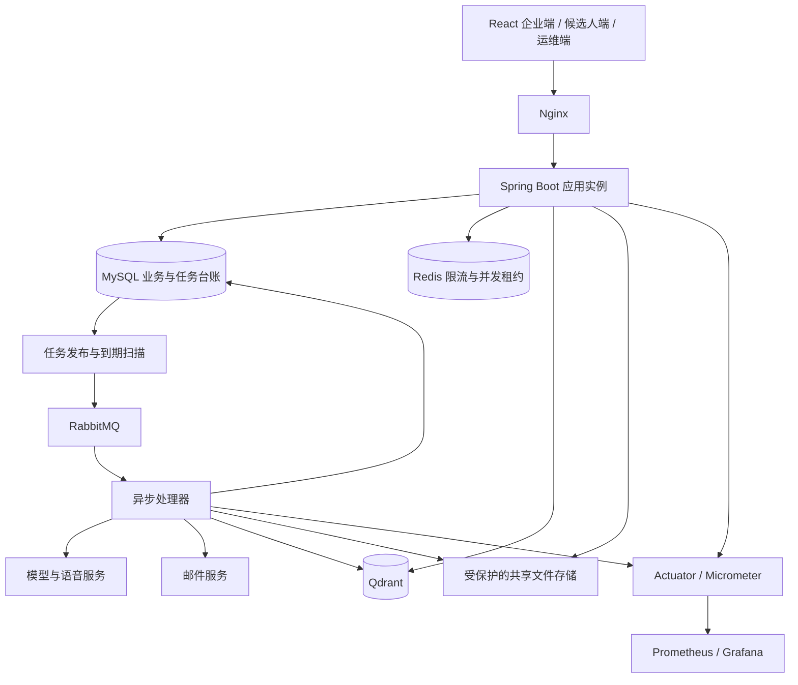

# InterviewPilot 企业招聘与 AI 面试平台 V1 改造方案

日期：2026-09-09  
状态：实施方案，尚未实施；下述新增功能、容量目标均不代表当前已具备。  
目标用户：企业招聘负责人、面试官、求职候选人、平台运维人员。  
项目目标：交付功能闭环、可演示、可部署、可测试的 Java 后端求职项目，并形成有实测证据的工程案例。

## 1. 产品定位与第一版边界

企业发布岗位并接收投递，根据 JD、简历和企业知识库制定面试方案，批量邀请候选人参加 AI 面试，结合回答证据进行人工评审。

完整主线：

V1 按完整版本交付。第 12 节的阶段是开发顺序，每个阶段均属于本次版本，不把通知、日程、权限、异常处理或验收留作口头上的“后续完善”。

### 1.1 V1 必须交付

- 企业与成员管理、岗位发布、候选人投递、简历版本和岗位证据分析。
- 企业题库、面试方案编辑与发布、公共题与简历定制题、企业知识库混合检索。
- 批次创建、逐人准备进度、批量邀请、站内与邮件通知、失败重试。
- 候选人邀请确认、日程、改期、提醒、ICS 日历文件导出。
- 文本与语音面试、断线恢复、限时规则、提交幂等、结束与异常恢复。
- AI 评估、回答证据、人工复核、评审记录、下一轮邀请和候选人反馈。
- 企业统计、平台任务管理、配额、审计、监控、自动化测试和可复现压测。
- 数据迁移、部署文档、演示数据、外部依赖故障时可解释的界面状态。

### 1.2 明确不进入 V1 的产品

全站职位推荐和搜索引擎、猎头 CRM、薪酬与入职管理、视频会议、在线代码执行、摄像头监考、通用流程拖拽引擎、自动淘汰候选人、外部日历双向同步、通用 MCP 工具平台、微服务拆分。

V1 支持招聘轮次和配置化 AI 面试阶段；人工复核后可以发起下一轮。暂不管理多人现场面试官的日历冲突与会议室资源。

## 2. 角色、页面与操作权限

一个账号可以同时是候选人和某企业成员，进入企业空间时明确当前企业身份。企业权限和候选人权限分别校验。

| 角色 | 权限范围 |
|---|---|
| 企业管理员 | 企业信息、成员邀请/停用、角色分配、全部岗位与招聘记录、企业设置 |
| 招聘人员 | 被授权岗位、投递管理、方案与批次、邀请、评审协调、结果发布 |
| 面试官 | 被指派的投递与面试、证据报告、提交人工评语；无成员管理权限 |
| 候选人 | 自己的简历、投递、邀请、日程、作答与已公开反馈 |
| 平台管理员 | 企业开通/停用、模型配置、配额、任务故障和系统指标；默认不浏览简历及回答正文 |

企业管理员可授权招聘人员管理具体岗位。面试官访问通过明确指派记录授权，不因知道面试 ID 而获得访问权。最后一名有效企业管理员不可被直接移除。

### 2.1 企业端页面

1. 工作台：待处理投递、批次准备进度、待评审面试、即将截止批次。
2. 岗位管理：草稿、发布、关闭、JD 版本、岗位公开链接。
3. 投递管理：列表筛选、简历预览、分析结果、指派面试官、流程记录。
4. 题库与方案：人工题、AI 草稿、考察维度、评分标准、发布历史。
5. 面试批次：候选人选择、时间窗口、逐人出题状态、下发结果、重试/撤销。
6. 面试与评审：回答记录、来源证据、AI 报告、人工意见、结果发布。
7. 企业知识库：文件上传、索引状态、重建、删除、检索调试。
8. 统计：投递量、邀请确认率、完成率、阶段人数、处理时长、AI 用量。
9. 企业设置：成员与授权、通知模板、配额使用情况、审计记录。

### 2.2 候选人端页面

1. 企业公开岗位页与岗位详情，支持链接投递。
2. 我的简历：上传、解析状态、版本管理、预览。
3. 我的投递：岗位、投递时间、公开的进度状态、撤回。
4. 面试邀请：企业、岗位、轮次、时间规则、确认/拒绝。
5. 我的日程：列表/日历视图、计划开始时间、改期、ICS 下载。
6. 面试准备：规则说明、设备测试、AI 使用说明、语音录制确认。
7. 面试作答：文本/语音、服务端剩余时间、重连、提交结果。
8. 面试结果：完成状态、企业已公开的反馈。
9. 通知中心：未读消息、邀请和提醒跳转。

### 2.3 平台运维页面

企业状态、全局模型配置、企业额度、失败任务、通知投递记录、受控重试、系统健康。运维页面隐藏简历原文和模型密钥，所有管理动作写审计。

## 3. 核心业务规则

### 3.1 岗位、投递与简历分析

- 企业填写职位名称、JD、地点、岗位类型、考察能力和招聘说明，发布后可生成新版本。
- 候选人投递时选定简历版本；保存岗位版本与简历版本引用，后续修改不影响此次投递。
- V1 同一候选人对同一岗位只保留一条投递记录。撤回后可显式重新提交，产生新的材料快照和流程事件，历史邀请不复用。
- 企业可批量选择投递记录开展面试。V1 不以任意邮箱批量导入替代真实投递关系。
- 简历解析提取教育、技能、实习、项目及对应原文位置。扫描文件无法可靠解析时显示原因并支持更换文件，不把空解析标为成功。
- 分析结果按 JD 要求输出：已有证据、证据不足、待核实问题。结论需关联简历片段。
- 缺少描述不得直接解释为缺少能力；不根据年龄、性别等与岗位能力无关的信息评分。
- 分析失败允许重试及人工继续操作；缺少有效解析时，企业可选择使用公共题，不静默伪造个性化内容。
- 当前“措辞优化、简历美化评分”退出企业主流程。旧个人功能保留在独立练习入口，企业无法访问个人优化记录。

### 3.2 面试方案与题目准备

方案由顺序阶段组成，配置阶段类型、题量、难度、追问上限、考察维度、题目来源、作答方式、总时长和反馈策略。支持自我介绍、基础知识、项目经历、场景分析，不引入任意条件分支流程引擎。

题目分为公共题和简历定制题。默认建议约 60% 公共题、40% 定制题，可由企业调整；此比例是产品默认值，不是已验证的最佳比例。

- 公共题可人工录入或 AI 生成，经招聘人员确认后发布。
- 定制题依据发布方案、此次投递材料和冻结知识范围生成；每题关联目标考察点与简历出处。
- 批次先准备、后下发。V1 对每位候选人的定制题提供预览与确认，可批量确认，但所有失败/异常项必须单独处理。
- 人工编辑题目后，对应评分标准与证据须重新校验，确认当前版本后才允许邀请。
- 题目准备完成时冻结题卡、评分规则、证据、模型与提示词版本；下发前企业可重新准备，下发后不原地修改。
- 企业资料未提供有效依据时，标注通用知识模式；不将模型知识包装成企业文档引用。
- 公共题保持批次内可比性。报告分别展示公共题和定制题结果；只对同一方案版本且可比的维度聚合，不自动生成淘汰线。

### 3.3 批次与邀请

批次绑定岗位、招聘轮次、方案版本、开放时间、最晚开始时间和硬截止时间。

- 第一版每次批量操作上限建议 200 人，必须可配置；最终可支持上限以实测为准。
- 批量操作返回批次 ID，逐人异步准备。页面展示成功、处理中、失败与原因。
- 发布操作只下发已准备、已确认的成员；明确列出未下发成员，不把部分成功显示为全部成功。
- 同一投递、同一轮次仅有一个有效邀请。重发通知沿用同一邀请；重新面试需显式关闭旧邀请并建立新 attempt，记录原因。
- 邀请链接使用不可预测的随机令牌，服务端只保存摘要，设置有效期并绑定接收人；首次领取需登录并校验账号及已验证邮箱。
- 链接本身不授予读取简历、评分标准或直接作答的权限；领取后使用正常会话授权。
- 撤销仅适用于尚未开始的邀请；进行中的面试使用独立的终止操作并记录原因。
- 岗位关闭停止新投递。既有邀请继续有效，若需取消须单独操作，避免隐式中止。

### 3.4 日程与提醒

V1 的 AI 面试是开放窗口内自助参加，无需预占人工面试官席位。

- 候选人确认邀请后选择计划开始时间，必须满足开放时间与最晚开始时间限制。
- 计划时间用于日程和提醒，实际允许开始的范围仍以邀请规则为准。
- 实际截止时间为 `min(实际开始时间 + 总时长, 企业硬截止时间)`；默认最晚开始时间保证候选人可获得完整时长。
- 所有时间按 UTC 存储，另外保存展示时区；界面明确用户所在时区。
- 在允许范围内自助改期；超出范围提交改期申请，由招聘人员同意或拒绝。批准后生成新的调度版本并通知候选人。
- 默认提醒为计划开始前 24 小时、1 小时，可配置；已错过的提醒不补发，取消/完成后不再发送。
- 日程版本变更时，旧提醒任务执行前校验版本并跳过；数据库保存到期任务，定时扫描领取，重启后继续处理。
- 导出 ICS，事件使用稳定 UID 和递增 SEQUENCE。下载导入无法保证外部日历自动更新，界面提示改期后需重新导入；站内日程为权威信息。

日历文件格式依据 [RFC 5545](https://www.rfc-editor.org/info/rfc5545/)。V1 不承诺 Google/Outlook 自动同步。

### 3.5 面试执行与异常

- 开始面试原子校验邀请归属、状态、时间窗口及准备结果，重复请求返回同一会话。
- 企业面试的题量、模型、知识库、难度由服务端读取发布快照，候选人请求不得覆盖。
- 服务端维护题目进度与时钟；客户端刷新、改本地时间或多开标签页不会重置时限。
- 作答带 requestId 和会话版本；重复提交返回既有结果，冲突提交提示刷新。
- 保留文本、录音转写、实时语音能力。语音异常允许转文本，显示已保存状态；未确认转写不作为正式答案。
- 重连后恢复已持久化的问题和回答，不自动恢复未提交的录音。AI 调用成功但客户端断线时，可查询已完成结果。
- 超时自动结束并评估已提交回答，未作答标记为未作答；基础设施失败不能记为候选人答错。
- 模型长时间不可用时显示中断状态，由企业允许重新安排或重试；不无限占用会话，不静默换模型继续评分。
- 面试中隐藏标准答案和即时评分；按企业策略在人工评审后公开反馈。

### 3.6 AI 评估与人工评审

- 按题卡稳定考察点 ID 输出覆盖、部分覆盖、缺失、错误或未评估状态，并关联回答与知识证据。
- 保存模型、提示词、评分规则版本，校验结构化结果和来源 ID；重试耗尽后标记评估失败。
- 总结可在部分评估失败时生成，但明确完整性和缺失项；无效评估不折算为 0 分。
- 人工评审包含维度评价、证据引用、意见和下一步决定。人工意见与 AI 原始结果分开保存。
- 评审草稿可修改，提交后通过新修订保留历史；指定招聘负责人发布最终结果，并以版本校验防止互相覆盖。
- 决定包括进入下一轮、待补充评估和结束流程。录用与合同管理不在 V1。
- 对候选人发布的反馈独立保存，不直接暴露企业内部笔记、题库或完整知识原文。

## 4. 状态模型与一致性约束

不同业务对象分别管理状态，禁止一个 status 同时表达通知、面试和评审进度。

| 对象 | 主要状态/结果 |
|---|---|
| 岗位 | DRAFT → PUBLISHED → CLOSED；编辑形成新版本 |
| 投递 | SUBMITTED → IN_PROCESS → FINISHED；可 WITHDRAWN；当前招聘轮次单独记录 |
| 方案版本 | DRAFT → PUBLISHED → RETIRED；发布内容不可变 |
| 批次成员准备 | PENDING → PREPARING → READY / FAILED；确认状态独立记录 |
| 邀请 | CREATED → ISSUED → ACCEPTED → STARTED → COMPLETED；分支 DECLINED / CANCELLED / EXPIRED |
| 面试会话 | 对现有状态扩展；明确准备、进行、完成、中断、终止；评估状态独立 |
| 通知投递 | PENDING → SENDING → ACCEPTED_BY_PROVIDER / FAILED / UNKNOWN；站内阅读状态独立 |
| 人工评审 | DRAFT → SUBMITTED；发布结果单独建版本 |

批次统计由成员结果聚合，包含部分失败，不能仅依赖一个“成功”布尔值。

关键不变量：

1. 每个邀请最多关联一次有效开始；唯一约束和条件更新共同保证。
2. 有效邀请占位绑定投递及轮次，在事务内持锁建立/释放，不能只靠先查后写防重。
3. 批量请求使用企业作用域的幂等键，保存请求摘要；相同键不同内容返回冲突。
4. 岗位、方案、简历、题卡和证据的版本引用不可被后续编辑悄悄替换。
5. 撤回投递与开始面试竞争时，由数据库锁或版本条件决定结果；撤回成功后禁止新开始，进行中会话按明确终止规则关闭。
6. 完成、超时、企业终止等竞争操作只能产生一个终态；所有后台回写检查任务代次和当前状态。
7. 审计事件与业务变更在同一事务落库；模型调用和邮件发送不在长数据库事务内执行。

## 5. 数据模型与模块划分

以下为逻辑模型。实现时允许将一对一、同生命周期的字段合并，但保留版本与权限关系。

| 模块 | 核心数据 | 关键关系 |
|---|---|---|
| organization | organization、membership、job_assignment | 成员关联账号与企业，岗位授权归企业 |
| recruitment | job、job_revision、application、application_event | 投递绑定候选人和提交时岗位/简历版本 |
| resume | resume_document、resume_revision、resume_analysis | 私有原始材料、不可变版本、按投递生成的分析 |
| assessment | question_bank、scheme、scheme_revision | 企业题库、方案阶段、考察点和评分标准 |
| campaign | interview_batch、batch_member、interview_invitation | 批次绑定方案版本，成员关联投递、题卡和邀请 |
| scheduling | candidate_schedule、reschedule_request、reminder_task | 日程及提醒绑定邀请和调度版本 |
| interview | 现有 session、turn、题卡及快照 | 招聘会话新增邀请、企业、候选人和用途关联 |
| review | review_assignment、review_revision、decision_revision | 指派、人工意见历史、对外发布结果 |
| notification | notification、delivery_attempt | 站内消息与各渠道投递结果分离 |
| knowledge | 现有知识库、文档、chunk、索引版本 | 新增明确个人/企业所有权，保留版本检索 |
| operations | audit_event、quota_usage、既有 async_task/outbox | 操作记录、用量台账、任务领取和恢复 |

设计约束：

- 不将“企业”伪装为一个个人用户，也不将候选人 userId 当成企业资料检索所有者。
- 招聘会话保留候选人账号关联，但访问权由企业关系、岗位指派或候选人身份决定。
- 个人简历属于候选人；企业只通过本企业投递关系读取被提交的版本。
- 结构化高频筛选字段使用关系列及索引；已发布阶段配置、材料及模型结果可用 JSON 快照。
- 主要组合索引围绕企业+岗位+状态+时间、候选人+时间、任务状态+nextAttemptAt。
- 跨企业关联通过服务端校验，并尽可能用包含企业键的唯一键/复合外键约束防止错误引用。
- 模块之间通过少量业务操作交互，如发布批次、领取邀请、开始面试、提交评审；避免跨模块任意改表。

## 6. 权限与资料生命周期

权限检查顺序：认证账号 → 验证有效企业成员身份/候选人身份 → 校验目标资源所属企业或本人 → 校验角色及岗位指派 → 校验操作状态。

- 企业 ID 来自已验证的企业上下文，不能信任请求体里的 tenantId。列表、详情、下载、导出、后台任务均覆盖隔离测试。
- 检索同时约束所有者类型、所有者 ID、知识库及文档版本；MySQL FULLTEXT 与 Qdrant 两路采用相同授权范围。
- 候选人作答可由服务端使用冻结证据进行评估，但候选人不能访问企业知识管理或任意检索接口。
- 文件下载走授权入口；共享存储内部路径不作为公开 URL。上传校验格式、大小及解析资源上限。
- 日志、指标和邮件不输出简历正文、令牌、模型密钥；审计保存动作、操作者、对象和时间。
- 候选人看到提交材料和 AI 面试用途说明；语音保存范围、可见角色及删除策略明确展示。
- 提供撤回、企业归档和管理员数据清理任务。保留期限可配置；涉及历史证据的删除先记录删除申请，按依赖和期限统一清理 SQL、文件、向量、导出件。
- 冻结引用保留期内禁止普通“删文件”破坏既有报告；到期清理可以使用显式清理状态，不能无限保留所有快照。
- AI 只评价岗位相关内容，最终招聘结果由招聘负责人发布。

## 7. 技术架构与技术栈

### 7.1 架构选择

采用模块化单体，同一代码库和数据库。支持单实例开发及双实例验证，后台消费者通过配置控制并发。需要时可用同一产物分别运行 Web/Worker 角色，但 V1 不构建独立微服务体系。

图中的异步处理器是逻辑执行角色，默认可以与应用同进程。

### 7.2 技术选型清单

| 范围 | 选择 | 状态与用途 |
|---|---|---|
| 后端 | Java 21、Spring Boot | 保留；当前构建为 Boot 4.0.1 |
| AI | Spring AI、既有模型网关 | 保留；当前 2.0.0-M4，编码前验证依赖兼容性，不在业务改造中盲目升级 |
| 权限 | Spring Security、JWT、企业/岗位授权 | 在现有认证上扩展；成员停用应立即阻断企业权限 |
| 持久层 | MySQL 8.4、JPA、Flyway | 保留；事务、乐观锁、唯一约束、版本迁移 |
| 限流与缓存 | Redis 7.4、Redisson | 保留；企业/用户限流和模型并发租约，数据库维持业务正确性 |
| 异步 | RabbitMQ 4、已有任务表/Outbox | 保留扩展；出题、分析、评估、通知和恢复 |
| 检索 | Qdrant、MySQL ngram FULLTEXT、RRF | 保留；企业隔离与真实评测补齐 |
| 文档解析 | Apache Tika | 保留；明确可解析格式及失败状态 |
| 前端 | React 18、TypeScript、Vite、React Router | 保留；复用现有风格建设三端，避免同步重写前端技术体系 |
| 实时交互 | REST、SSE、WebSocket | 保留；状态通知、生成结果和实时语音 |
| 邮件 | Spring Mail / SMTP | 新增；本地邮件接收器做联调，验收使用授权测试邮箱 |
| 日程 | 数据库调度任务、ICS | 新增；版本化提醒与标准日历导出 |
| 文件 | 私有文件目录+Docker 共享卷 | 保留并验证双实例共同访问；只支持同主机部署，跨主机再接对象存储 |
| 可观测性 | Actuator、Micrometer、Prometheus、Grafana | 完善；指标采集、仪表盘、告警规则 |
| 测试 | JUnit、Testcontainers、WireMock、Vitest | 保留；补 Playwright 端到端和 k6 压测脚本 |
| 部署 | Docker Compose、Nginx、CI | 完善；分核心/监控/测试配置，依赖版本锁定 |

新增依赖的确切版本在实施第一阶段核验并固定到构建文件/锁文件，以上选型不代表完成了兼容性测试。Spring Boot 可通过 Micrometer 暴露 Prometheus 指标，参见 [官方指标文档](https://docs.spring.io/spring-boot/reference/actuator/metrics.html)。

不新增 ES、MongoDB、Neo4j、Kafka、Nacos、Seata 或工作流引擎。已有组件足以支持此次需求。MCP 不是邮件、日程和招聘数据的必要接入方式，不进入本版依赖。

## 8. 可靠任务、通知与资源治理

### 8.1 异步任务

业务变更和任务登记同事务提交 → 发布器发送消息 → Broker 确认 → 消费者原子领取 → 执行外部调用 → 校验任务代次并落库 → 确认消费。

消息可能重复，采用至少一次投递和业务幂等，不宣称端到端 exactly-once。生产者确认和消费者确认承担不同职责，依据 [RabbitMQ 可靠性说明](https://www.rabbitmq.com/docs/reliability)。

- 分离交互追问、批量准备、文档索引、通知的队列/并发预算，避免批量任务占满交互容量。
- 企业维度限制批次人数、待处理任务数、模型并发和每日调用预算；超限给出明确状态与重试时机。
- 持续记录等待时间、执行时间、失败类型、尝试次数；到期租约可被其他实例接管，旧 worker 回写必须被拒绝。
- 重试采用有上限的退避；永久性错误直接失败；提供受权限控制的人工重试和取消。
- DB 台账记录用量预占、结算或释放。Redis 只做快速准入；超时调用的外部实际用量可能未知，标记估算/待核对，不能虚报精确账单。

### 8.2 通知语义

- 站内消息唯一键按接收人、业务事件、版本防重。
- 邮件按邀请及通知事件标识记录投递尝试；SMTP 接受只表示服务商接收，不显示“候选人已读”。
- 发送超时可能发生服务商已接收但本地未知，记录 UNKNOWN，限制自动补发；邮件渠道不承诺绝对无重复。
- 通知失败不回滚已创建邀请；企业可查看原因并重发，候选人仍可在站内找到邀请。
- 邮件携带企业/岗位、时间规则和安全入口，不发送评分规则、简历附件或内部评语。
- 到期提醒执行前重新读取邀请状态和调度版本，取消/改期与发送竞争时尽量抑制旧消息；已交给服务商的邮件无法撤回，日程详情始终展示最新状态。

## 9. RAG 与评估质量工程

检索链路：企业权限范围 → 冻结文档版本 → 题目查询/关键词 → 向量与关键词候选 → RRF → 去重与预算 → 证据快照 → 出题/评价。

- 在两路检索和下载中贯彻相同企业范围；保留个人练习的独立范围。
- 为知识 chunk、题卡考察点、简历片段和回答片段保留稳定引用，模型输出只允许引用本次提供的来源。
- 区分成功无匹配、依赖失败和单路降级；报告标明实际依据。
- 第一版建立至少 60 条人工标注检索问题，覆盖术语、同义表达、代码/表格、跨段内容、无答案和企业隔离。
- 数据区分调参集与保留验收集；比较 vector、keyword、hybrid 的 HitRate@K、Recall@K、MRR、无答案误命中率与 P95 延迟。
- Recall@K 按相关片段集合计算，不能用“命中问题数/总问题数”冒充；现有预设候选分数测试只能作为排序回归，不算真实检索效果。
- 建立至少 30 份人工审阅的回答样本，检查评分依据、事实错误、引用有效性和未评估处理；模型随机性采用重复运行观察波动。
- 是否新增 reranker、父子分块或查询重写由失败样例和对照结果决定，不预先承诺收益。

## 10. 接口与前后端约定

建议资源入口：

| 入口 | 用途 |
|---|---|
| `/api/public/jobs` | 已发布岗位公开信息 |
| `/api/candidate/applications` | 投递、查询、撤回 |
| `/api/candidate/invitations` | 领取、确认、拒绝与日程 |
| `/api/candidate/interviews` | 开始、作答、恢复、已公开结果 |
| `/api/organizations/{id}/jobs` | 企业岗位与版本 |
| `/api/organizations/{id}/applications` | 投递分析、指派、流程处理 |
| `/api/organizations/{id}/schemes` | 面试方案与发布 |
| `/api/organizations/{id}/batches` | 批次准备、预览、下发与重试 |
| `/api/organizations/{id}/reviews` | 人工评审与结果发布 |
| `/api/notifications` | 当前账号站内通知 |
| `/api/platform/tasks` | 运维故障定位及受控操作 |

这是资源划分草案，具体 DTO 在实施时定义。服务端必须验证路径中的组织 ID。批量写操作返回任务/批次引用；异步进度可查询并通过 SSE 更新，重连后以数据库状态补齐。列表分页与排序字段白名单，导出遵循同等权限。

统一处理无权限、已过期、状态冲突、配额不足、准备失败和上游暂不可用。用户界面给出下一步操作，不直接展示内部异常堆栈。

## 11. 现有项目迁移策略

1. 开始编码前记录工作区基线，保留现有未提交的混合检索改动；重新核验迁移编号和测试状态。
2. 新增企业、岗位、投递、方案等表，先采用兼容的增量迁移，不重建数据库。
3. 为面试增加用途 `PRACTICE / RECRUITMENT`。历史记录回填 PRACTICE，原个人归属保持不变，不随意迁入示例企业。
4. 简历建立不可变版本；历史简历生成首个版本，旧会话继续使用既有 brief 快照，不能声称可恢复原本未存储的历史文件。
5. 招聘用途的创建入口只接收邀请标识，服务端解析方案；个人创建入口继续独立校验，防止通过练习接口绕过企业规则。
6. 将固定流程实现保留用于历史/个人模式，新增方案驱动流程；复用作答事务、题卡和评估执行能力。
7. 知识归属引入个人/企业类型，迁移 MySQL 和 Qdrant 的过滤元数据。新范围检索上线前做双路隔离回归，历史文档按需要重建。
8. 共享文件、删除和保留策略完成前，不开放企业资料给候选人直接下载。
9. 前端逐步接入企业空间和候选人中心，旧个人练习入口保留，避免历史记录丢失。
10. 上线前备份数据库、文件及 Qdrant；在副本验证迁移。回滚应用必须与扩展后 schema 兼容，不能以删表代替回滚。

## 12. 实施阶段与完成条件

| 阶段 | 交付内容 | 完成条件 |
|---|---|---|
| A：身份与招聘基础 | 企业/成员/权限、岗位、简历版本、投递、三端导航 | 两家企业隔离；候选人完整投递；历史数据可读 |
| B：分析与方案 | JD 证据分析、企业题库/知识库、方案版本、配置化流程 | 分析有原文依据；方案可预览发布；发布版本不可变 |
| C：批次与触达 | 逐人出题、确认下发、邀请、邮件/站内通知、日程/改期/提醒/ICS | 批量部分失败可恢复；邀请仅本人领取；旧提醒失效 |
| D：面试与评审 | 邀请驱动面试、限时、语音、证据报告、人工复核、下一轮 | 从投递到下一轮/结束全流程贯通；异常不会变成低分 |
| E：工程交付 | 用量配额、审计、运维、监控、评测、压测、部署和演示 | 第 13 节验收通过，产生可复现报告和部署说明 |

每个阶段同时交付前端、后端、迁移和必要测试。全部阶段完成才称 V1 完整交付。

范围较大，不能按“一次加几个接口”估算工期。A 阶段完成后，根据实际权限/迁移复杂度和每日投入更新工期；未确认开发投入前不承诺固定周数。

## 13. 验收标准与性能实验

### 13.1 必须通过的业务验收

1. 两家企业、不同角色和三名候选人可独立完成招聘流程，越权访问、检索、下载、导出全部拒绝。
2. 候选人修改个人简历后，已投递版本和已下发题卡不变；岗位及方案同理。
3. 对同一批次重复发布、重复点击开始、重复投递消息、重复提交答案，不产生重复有效邀请或重复状态推进。
4. 出题失败、邮件失败、模型失败各自可见且可恢复，其他候选人的流程可继续。
5. 改期、拒绝、撤销后旧提醒不再由待执行任务发送；站内日程始终准确，ICS 文件可被至少一种常见日历客户端导入。
6. 到期与开始、撤回与开始、超时与提交发生竞争时，状态符合明确规则。
7. 刷新和断线能恢复持久化面试进度；文本和语音各完成一次真实模型端到端流程。
8. 评估缺失不记为 0 分；人工修改有历史；候选人只能看到明确发布的反馈。
9. 成员停用后权限失效；邀请链接不可跨账号领取；后台运维操作有审计。
10. 旧个人会话能查看，既有检索和答案处理回归通过。

### 13.2 自动化与故障验证

- 后端：真实 MySQL/RabbitMQ/Qdrant 集成测试验证事务、租约、去重、企业范围与版本过滤。
- 模型及邮件：可控桩模拟慢响应、超时、结构错误、重复结果与未知投递状态。
- 前端：关键表单/权限显示测试，Playwright 覆盖企业发布→候选人参加→人工评审主线。
- 双实例：杀死领取任务的实例，验证租约恢复和旧任务回写隔离；Redis/MQ 暂不可用时状态可解释。
- CI：后端测试、前端测试及构建、迁移检查；真实付费模型测试单独执行，不将密钥写入仓库。

### 13.3 首轮容量实验

以下是实验场景和候选目标，不是现有性能结论；必须在报告写明机器、依赖版本、数据规模、并发与模型桩设置。

| 场景 | 实验负载 | 关注指标 |
|---|---|---|
| 批量邀请 | 一批 200 人，含重发和局部失败 | 接口入队 P95、完成时间、重复有效邀请数 |
| 面试交互 | 从 10、30 到 50 并发逐级增加 | 作答接收延迟、等待时间、受控拒绝率 |
| 普通业务 | 分页投递/邀请列表 50 并发 | P95、慢 SQL、连接池、错误率 |
| 资源竞争 | 批量索引+出题与在线面试同时运行 | 交互延迟变化、队列积压与恢复 |
| 故障恢复 | 双实例重复消息及 worker 中断 | 丢失任务数、重复推进数、恢复耗时 |

首轮暂定同机测试下普通业务 P95 < 500ms、异步接收接口 P95 < 1s，排除 LLM 完成耗时；允许根据基线及设备调整，但必须记录原因和前后数据。已确认业务操作零丢失、重复有效邀请/重复推进为零属于正确性要求。

真实模型另测首响应、完整响应、Token 用量、超时和失败率；不能用模型桩测试声称真实 AI 面试承载量。成本按实际模型用量和当时计价计算，未返回 usage 时注明估算。

### 13.4 监控与交付材料

监控覆盖 HTTP 延迟/错误、数据库连接池、队列积压、最老待处理任务年龄、任务重试、模型等待/失败、通知失败、RAG 降级和 JVM。企业用量放业务台账，避免把用户/邀请 ID 作为 Prometheus 高基数标签。

交付材料：架构图、数据关系和状态说明、部署/备份恢复文档、演示账号与合成数据、端到端演示步骤、真实 RAG 对照报告、容量/故障实验报告、已知限制。

## 14. 演示主线与项目讲述

使用合成简历与授权测试邮箱演示：

1. 企业发布“Java 后端实习”岗位，候选人投递包含 Redis 项目的简历。
2. 简历分析找到缓存相关描述，并提出待核实问题。
3. 招聘人员发布公共题+项目定制题方案，批量准备三名候选人，演示一项失败后重试。
4. 候选人收到邀请、确认并安排日程，导出日历，进行一次改期。
5. 完成文本/语音面试，演示重复提交或刷新后恢复。
6. 企业看到回答证据与分析，提交人工评审，发布反馈或进入下一轮。
7. 展示监控、失败任务恢复和跨企业访问被拒绝的验证结果。

项目最终可讲述的工程主题是：企业与个人资料授权、不可变面试版本、可靠批量任务与通知、受资源约束的 AI 执行、可追溯的混合检索与人工评审。简历中的性能与效果数字全部来自本版实测，不提前编写提升比例。
